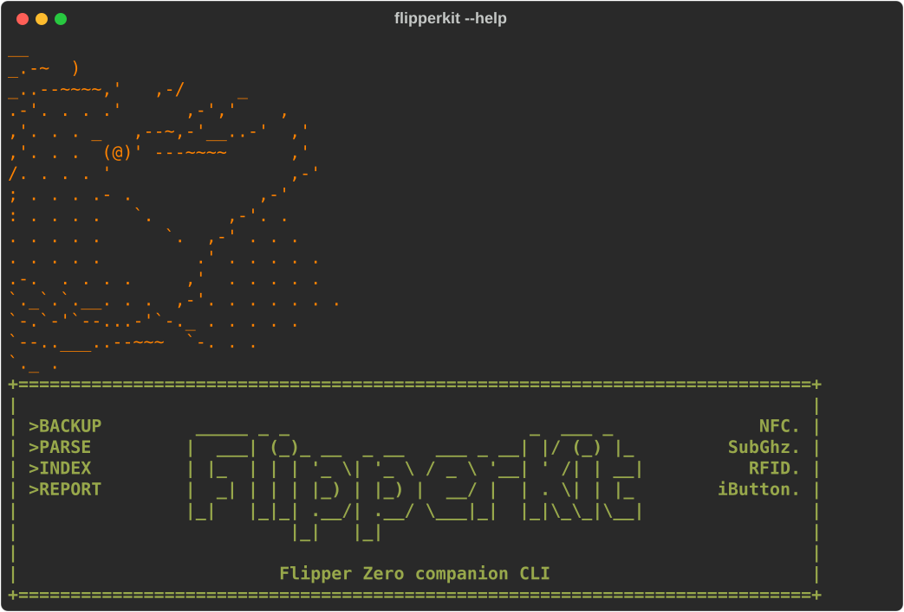
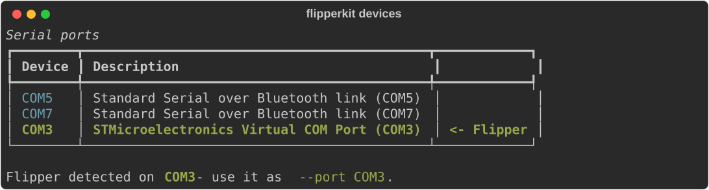
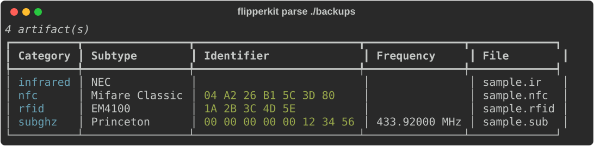

# FlipperKit

```
                                                   __
                                               _.-~  )
                                    _..--~~~~,'   ,-/     _
                                 .-'. . . .'      ,-','    ,
                               ,'. . . _   ,--~,-'__..-'  ,'
                             ,'. . .  (@)' ---~~~~      ,'
                            /. . . . '                 ,-'
                           ; . . . .- .            ,-'
                          : . . . .   `.       ,-'. .
                         . . . . .      `.  ,-' . . .
                        . . . . .         .' . . . . .
                       .-.  . . . .     ,'  . . . . .
                    `._`.`.__. . .  ,-'. . . . . . .
                       `-.`-'`--...-'`-._ . . . . .
                          `--..___..--~~~  `-. . .
                                             `._ .
+============================================================================+
|                                                                            |
| >BACKUP         _____ _ _                       _  ___ _              NFC. |
| >PARSE         |  ___| (_)_ __  _ __   ___ _ __| |/ (_) |_         SubGhz. |
| >INDEX         | |_  | | | '_ \| '_ \ / _ \ '__| ' /| | __|          RFID. |
| >REPORT        |  _| | | | |_) | |_) |  __/ |  | . \| | |_        iButton. |
|                |_|   |_|_| .__/| .__/ \___|_|  |_|\_\_|\__|                |
|                          |_|   |_|                                         |
|                                                                            |
|                         Flipper Zero companion CLI                         |
+============================================================================+
```


A companion command-line toolkit for the [Flipper Zero](https://flipperzero.one/),
tested on Linux, macOS and Windows. Back up the SD card, parse captured artifacts,
index them into SQLite, and generate shareable reports — the things the mobile app
does poorly or not at all.

[](https://github.com/juandresrodca/FlipperKit/actions/workflows/ci.yml)

> **Built for engineers, not just users.** Where the official app lets you *use*
> the device, FlipperKit treats what it captures  as **data to manage**: versioned
> backups, a searchable index, and reports you can hand to someone else.

```
┌─────────┐   backup   ┌──────────┐   parse/index   ┌──────────┐   report   ┌──────────────┐
│ Flipper │ ─────────► │  local   │ ──────────────► │  SQLite  │ ─────────► │ html/md/json │
│  (USB)  │            │  mirror  │                 │  index   │            │   report     │
└─────────┘            └──────────┘                 └──────────┘            └──────────────┘
```

## Why this exists

The Flipper stores everything as small text  files on  its SD card (`.nfc`, `.sub`,
`.rfid`, `.ir`, …). Over time that turns into an unsearchable pile. FlipperKit:

- **Backs up** the SD card over the serial  CLI, skipping unchanged files.
- **Parses** each artifact into a normalized  record (category, protocol, UID/key, frequency…).
- **Indexes** records in SQLite, de-duplicated  by SHA-256.
- **Reports** the collection as a clean HTML  page, Markdown table or JSON.

## Screenshots

`flipperkit --help` — the dolphin banner and command list:



`flipperkit devices` — auto-detects and highlights your Flipper's serial port:



`flipperkit parse ./backups` — captured artifacts parsed into a searchable table:



## Install

Requires Python 3.9+.

### Quick install (use it as a command)

Installs `flipperkit` as a normal command available from any terminal:

```bash
git clone https://github.com/juandresrodca/FlipperKit
cd FlipperKit
pip install -e .
```

The `-e` (editable) flag points the command at your source folder, so code
changes take effect immediately — no reinstall needed. Then, from any directory:

```bash
flipperkit --help
```

> **Windows note:** the `flipperkit` command lands in your  Python `Scripts`
> directory. If the shell can't find it, that directory isn't  on your `PATH`  
> either add it, or run the tool with `python -m flipperkit ...`.
>
> **Uninstall:** `pip uninstall flipperkit`

### Isolated / dev install

To keep FlipperKit and its dependencies out of your global Python , use a virtual
environment. Add `[dev]` to also install the test dependencies (`pytest`):

```bash
git clone https://github.com/juandresrodca/FlipperKit
cd FlipperKit
python -m venv .venv && . .venv/Scripts/activate   # Windows
# source .venv/bin/activate                         # macOS / Linux
pip install -e ".[dev]"
pytest
```

## Quickstart — no Flipper needed

Every command works on a folder of files, so you can run the whole pipeline on the
bundled samples before you plug anything in:

```bash
flipperkit index tests/fixtures --db demo.db          # parse and index the samples
flipperkit report --db demo.db -f html -o demo.html   # write a shareable report
```

Open `demo.html` in a browser to see the report. [docs/recipes.md](docs/recipes.md)
assembles the same commands into real workflows — a dated weekly backup, the SQL
that answers *what is new since last time*, and how to hand the contents of a card
to somebody who does not have FlipperKit installed.

## Usage

```bash
# Find your Flipper's serial port
flipperkit devices

# Show device info
flipperkit info --port COM3

# Mirror the SD card into ./backups (unchanged files are skipped)
flipperkit backup ./backups --port COM3

# Parse a file or folder and print a table
flipperkit parse ./backups

# Build a searchable SQLite index
flipperkit index ./backups --db flipperkit.db

# Generate a report
flipperkit report --db flipperkit.db --format html --out report.html
flipperkit report --db flipperkit.db --format md --category subghz

# Update to the latest version (when installed from a git clone)
flipperkit update --check   # see if a newer version is available
flipperkit update          # pull and apply it
```

The port is `COM3`-style on Windows, `/dev/cu.usbmodemflip_<name>1` on macOS and
`/dev/ttyACM0` on Linux. [docs/serial-ports.md](docs/serial-ports.md) has the per-OS
detail — udev rules and the ModemManager clash on Linux, `cu.` versus `tty.` on macOS,
and what to check when `devices` finds nothing.

## Supported artifacts

| Extension | Category   | Extracted fields                        |
| --------- | ---------- | --------------------------------------- |
| `.nfc`    | `nfc`      | device type, UID                        |
| `.sub`    | `subghz`   | protocol, frequency, key, preset        |
| `.rfid`   | `rfid`     | key type, data                          |
| `.ir`     | `infrared` | protocol, signal count, signal names    |
| `.ibtn`   | `ibutton`  | protocol/key type, data                 |
| `.u2f`    | `u2f`      | recognised; raw key/values only, no dedicated fields yet ([#6](https://github.com/juandresrodca/FlipperKit/issues/6)) |

These are exactly the extensions `parsers.EXT_CATEGORY` recognises; anything else on
the card is skipped.

## Architecture

```
src/flipperkit/
├── client.py    # the ONLY module that imports pyserial (Flipper CLI wrapper)
├── backup.py    # sync logic, depends on a small RemoteFS protocol → testable with a fake
├── parsers.py   # Flipper text format → FlipperRecord
├── db.py        # SQLite index (dedup by SHA-256)
├── report.py    # JSON / Markdown / HTML renderers
└── cli.py       # Typer CLI wiring it together
```

The hardware boundary is deliberately thin and isolated. Everything else — parsing,
indexing, reporting, even the recursive backup walk — is tested against in-memory
data, so `pytest` runs green with no Flipper attached.

```bash
pytest
```

## ⚖️ Legal & ethical use

FlipperKit is a **data-management tool for artifacts you have lawfully captured**
from **your own devices** or from systems you are **explicitly authorized** to
test. It does not exploit anything — it organizes files the Flipper already wrote.
Cloning, replaying, or reading credentials you do not own may be illegal in your
jurisdiction. Use it for learning, lab work, and authorized assessments only.

[SECURITY.md](SECURITY.md) covers the other half of that: where the tool's own
surface actually is — the backup destination path, the parsers, the Markdown
renderer, `flipperkit update` — and how to report a problem in it privately. Worth a
read before you point `--port` at anything, because your index and your reports hold
the key material your captures came with.

## Contributing

Most of this repository can be worked on **without a Flipper Zero** — the
hardware boundary is one module and everything else is tested against files on
disk. [CONTRIBUTING.md](CONTRIBUTING.md) has the setup, a worked example of
adding a parser, and the rule that fixtures must be synthetic. Three open issues
are labelled *good first issue*.

Participation is governed by the [Code of Conduct](CODE_OF_CONDUCT.md), and
anything a user would notice belongs in [CHANGELOG.md](CHANGELOG.md) under
*Unreleased* in the same pull request. Anything that looks like a vulnerability
goes through [SECURITY.md](SECURITY.md) instead of the issue tracker.

## License

[MIT](LICENSE)
